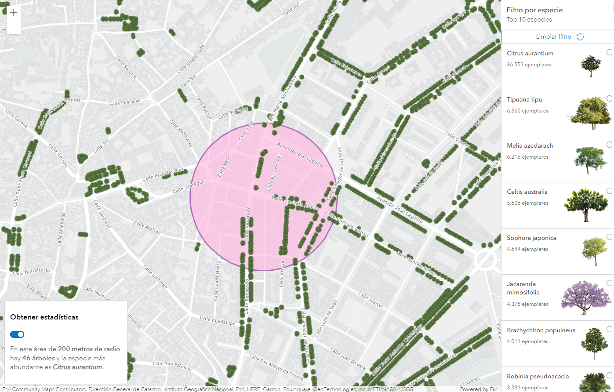

# ArcGIS API for JavaScript
## Ejemplos de uso de la librería

### [Arbolado de Sevilla](https://libertadcc.github.io/ArcGIS_API_JS/ArboladoSevilla/arboladoSevilla.html)

Aplicación donde están representados todos los árboles de la ciudad de Sevilla. Se hacen peticiones en el lado del cliente para filtrar por las diferentes especies. 

Se hacen cálculos estadísticos sobre una zona determinada viendo el número de árboles totales y calculando la especie más abundante.

